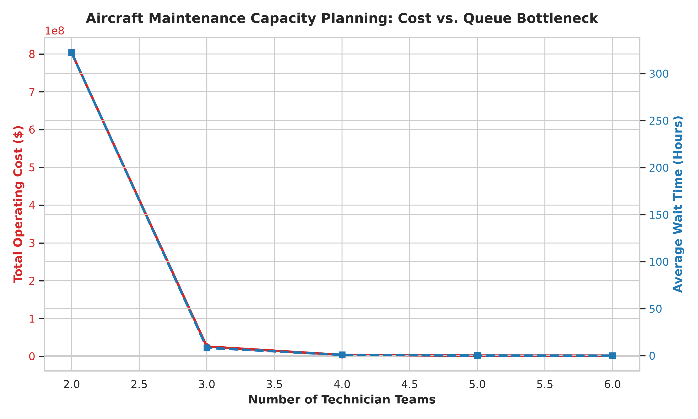

# ✈️ Aircraft Maintenance Operations & Capacity Optimization Model
## 📌 Executive Summary
In commercial aviation maintenance, understaffing leads to massive aircraft downtime penalties ($1,500/hr), while overstaffing creates idle labor inefficiencies. This project utilizes **Stochastic Discrete-Event Simulation (`SimPy`)** and **Financial Trade-Off Modeling** to analyze capacity bottlenecks and identify the optimal staffing model for an aircraft maintenance facility over 5,000 operational hours.
---
## 🔬 Engineering Problem & Key Findings
* **The Queueing Bottleneck:** At low staffing levels ($\le 3$ teams), incoming aircraft face severe queueing delays due to stochastic arrival spikes and variable service times.
* **The Cost Sweet Spot:** While adding technicians increases payroll, it exponentially reduces aircraft downtime penalties.
* **Optimal Recommendation:** Increasing staffing from **3 to 6 technician teams** reduces total operating costs by over **93%**, eliminating catastrophic queueing backlogs.
---
## 📊 Performance & Optimization Results
| Technician Teams | Total Aircraft Processed | Avg Wait Time (Hrs) | Labour Cost ($) | Delay Cost ($) | Total Operating Cost ($) |
| :---: | :---: | :---: | :---: | :---: | :---: |
| **2** | 1,661 | 322.37 | $500,000.00 | $803,174,599.60 | $803,674,599.60 |
| **3** | 1,989 | 8.40 | $750,000.00 | $25,074,299.96 | $25,824,299.96 |
| **4** | 1,957 | 0.92 | $1,000,000.00 | $2,714,979.07 | $3,714,979.07 |
| **5** | 1,974 | 0.22 | $1,250,000.00 | $641,875.90 | $1,891,875.90 |
| **6** | 1,982 | 0.09 | $1,500,000.00 | $270,674.03 | **$1,770,674.03 (Optimal)** |

### 📈 Cost vs. Queue Bottleneck

---
## 🛠 Tech Stack & Tools
* **Simulation Framework:** Python 3.x, `SimPy` (Discrete-event simulation)
* **Data Processing & Analytics:** `Pandas`, `NumPy`
* **Data Visualization:** `Matplotlib`, `Seaborn`
---
## 🚀 How to Execute the Simulation
1. Clone the repository:
```bash
   git clone https://github.com/malathalassaf15-ctrl/Aircraft-Maintenance-Queue-Simulation.git
```
2. Navigate into the project folder:
```bash
   cd Aircraft-Maintenance-Queue-Simulation
```
3. Install dependencies:
```bash
   pip install -r requirements.txt
```
4. Run the simulation:
```bash
   python main.py
```
## 🖥 Interactive Dashboard
Launch the live Streamlit dashboard to explore staffing scenarios interactively:
```bash
streamlit run app.py
```
Adjust parameters in the sidebar, then use **Run Live Optimization Analysis** for a single staffing level, or **Run Full Comparison** to sweep 2–6 teams and find the cost-optimal staffing level automatically.
